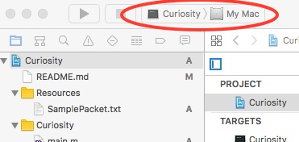
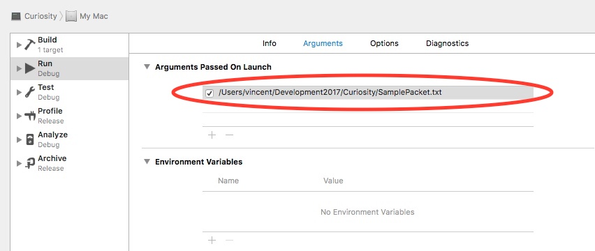
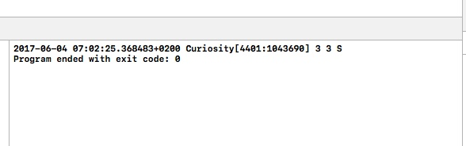

### Curiosity - The Mars Rover Challenge

There are two targets in the Curiosity Xcode project, one called Curiosity, which is the actual rover command line application, and one called TestSuite. The TestSuite target is an XCTTest based series of units tests for various classes in the project. Ideally there should be a few more tests in the test suite, but you did say to not make the project too elaborate, so the handling of movements and directions are thoroughly tested.

#### Running the Rover

The sample data is contained in a text file called SamplePacket.txt in the main directory of the project. The path to this file needs to be passed in to the rover application so that it can read it's command set from it. Due to the fact that this project is a command line executable for macOS ( i.e. Darwin in essence ) the easiest way to run it, is to configure the scheme arguments to pass the path in. Locate the SamplePacket.txt file in your project directory. Note the full path. Make sure you have the Curiosity scheme set as your active scheme as shown in the image below :-

Click on the Curiosity scheme, and when the menu pops up, select "Edit Scheme". It should look something like this :-

Change the argument highlighted in red in the above image to the full path of the SamplePacket.txt file that you noted earlier. Close the edit scheme window. Now run the Curiosity application. The output will be generated in the Xcode transcript, on the bottom right hand side of the Xcode window, as shown in the image below :-

You can also run the Curiosity application directly from the command line should you so wish. To do this build the Curiosity target. Expand the Products group in the Xcode navigator pane. Click on Curiosity, and then right click on it, and select the "Show in Finder" menu item. Open a Terminal window, drag the Curiosity executable from the Finder window into the Terminal window. This will copy the path of the executable onto the command line in the Terminal window. Now click on the SamplePacket.txt file in the Project and show it in the Finder as well. Drag the SamplePacket.txt file into the Terminal window as well, this will copy the full path of the SamplePacket.txt file onto the command line in the Terminal window. Push enter in the Terminal window, the Curiosity executable will run with the appropriate arguments and produce output similar to that below

~~~~
2017-06-04 07:11:17.329 Curiosity[4497:1077474] 3 3 S
~~~~

#### Running the Test Suite

To run the test suite, select the TestSuite scheme in Xcode. Select the "Test" option under the "Product" menu and the TestSuite will run. It should produce output similar to that below :-

~~~~
Test Suite 'All tests' started at 2017-06-04 07:13:40.008
Test Suite 'TestSuite.xctest' started at 2017-06-04 07:13:40.009
Test Suite 'TestSuite' started at 2017-06-04 07:13:40.009
Test Case '-[TestSuite testBackAndForth]' started.
Test Case '-[TestSuite testBackAndForth]' passed (0.163 seconds).
Test Case '-[TestSuite testCardinalDirections]' started.
Test Case '-[TestSuite testCardinalDirections]' passed (0.004 seconds).
Test Case '-[TestSuite testSkirtEdge]' started.
Test Case '-[TestSuite testSkirtEdge]' passed (0.001 seconds).
Test Case '-[TestSuite testUpAndDown]' started.
Test Case '-[TestSuite testUpAndDown]' passed (0.001 seconds).
Test Suite 'TestSuite' passed at 2017-06-04 07:13:40.180.
	 Executed 4 tests, with 0 failures (0 unexpected) in 0.169 (0.170) seconds
Test Suite 'TestSuite.xctest' passed at 2017-06-04 07:13:40.180.
	 Executed 4 tests, with 0 failures (0 unexpected) in 0.169 (0.171) seconds
Test Suite 'All tests' passed at 2017-06-04 07:13:40.181.
	 Executed 4 tests, with 0 failures (0 unexpected) in 0.169 (0.173) seconds

Test session log:
	/Users/vincent/Library/Developer/Xcode/DerivedData/Curiosity-axzskomcxfwoocfhojblcizzptrs/Logs/Test/F96D7D5E-DD08-495F-95CD-28EDE85C3041/Session-TestSuite-2017-06-04_071337-I8nRxh.log

Program ended with exit code: 0
~~~~

#### Design Decisions

~~~~
Note: For the sake of clarity I have omitted the ROV prefix when 
talking about classes, Objective C does not have namespaces 
consequently the approved mechanism for avoiding class naming 
conflicts is by prefixing one's classes with a three letter 
prefix that relates to your project somehow. In this case 
the prefix is ROV and hence it can essentially be ignored.
~~~~

Fundamentally the application consists of a CommandPacket protocol, two classes that implement that protocol, a rover, a direction and a hierarchy of command objects. I defined the CommandPacket ( ROVCommandPacket ) as a protocol because I wanted to be able to inject dummy test packets into the rover for execution while running unit tests. Using a protocol allowed me to do this. There are two classes that implement the CommandProtocol, a TransmittedProtocol, which is the real deal, and contains the commands transmitted to the rover from Earth, and TestPacket, which is a mock packet that contains command sets generated for testing. This approach worked well and you can see how it is used in the TestSuite target. 

If I had been implementing this project in Swift I would rather have used an enum to represent cardinal directions, but unfortunately Objective C does not allow one to attach behavior to an NS_ENUM and therefore I elected to code the CardinalDirection as a class. The reason I wanted to attach behavior to a CardinalDirection was so that I could encapsulate all of the logic associated with changing direction in that class. Doing this allowed me to very tidily encapsulate the logic, and hence none of the logic associated with changing directions escapes into either the rover or the grid or the commands. This is one of the fundamental principles of OO that a lot of people miss. A TransmittedPacket knows how to receive ( i.e. read ) it's contents from the RF antenna ( i.e. the text file ) and once again all the logic to do with this stays nicely inside the TransmittedPacket and does not pollute any other part of the application. 

When the packet decodes the command set it converts the sequence of movement commands into a collection of command objects ( nice example of the Command pattern which could very easily be extended to do nice logging of the trip or to reverse the rover ). The rover only knows about the basic Command class, it is unaware of the fact that there are several subclasses that actually encode the different commands. This approach is good for two different reasons :-

1. There is a standard interface to any command called "applyToRover:" and so the rover only has to know how to ask a command to apply itself to the rover. It has no knowledge of anything else
2. It's entirely likely that at some future date the rover is going to be asked to perform addtional tasks ( such as taking a photograph, digging up some soil etc ), and this approach allows us to trivially add additional commands into the stack.

Each command subclass knows how to ask the rover to do a particular thing, which is exactly what it does when asked to apply itself to the rover. The rover in turn when asked to do one of 3 things makes use of the it's current direction and it's current grid object to assist it in doing it's task. As mentioned previously the CardinalDirection object knows how to produce a new CardinalDirection according to the action the rover needs to take. This radically simplifies the internals of the rover and also allows us to test the logic assciated with directions independently of anything else. When moving to a new orientation or position, the rover asks it's direction to figure out a new direction or to adjust it's current location appropriately. The rover also makes use of the grid to check that it's staying within the bounds of the area to be explored, and shut down the movement if it is not. This should prevent the rover from straying into a dangerous area. 

I personally believe that when applications enter into potentially invalid states, it is better for them to terminate with a clear explanation ( and by this I mean throw an exception or halt ) rather than attempting to muddle on with a bad state. Obviously if the state is recoverable then it's a different matter, but typically systems can not take intelligent decisions when they stray into invalid states, hence it's better for them not to try and scream for help. 

I hope this explanation makes clear my design decisions. 